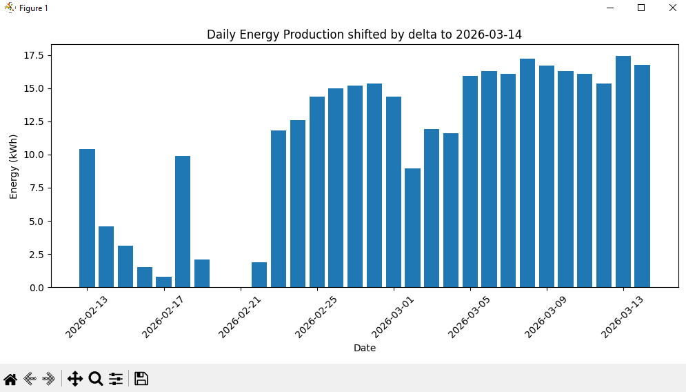

# SBFspot-Visualizer
Visualizing kWh data from SBFspot




## Overview
This workflow scans for SMA inverter Bluetooth devices, updates the configuration, downloads data, and processes it into visualizations.

---

Run:

```bash
SBFspot-Visualizer.bat
```

**Process and visualize data**

The batch script:
- Iterates over all yearly folders inside `./smadata/` (e.g., `2001`, `2023`)
- Copies processing scripts into each folder
- Runs data transformation
- Generates plots for visualization

---

## Requirements

- Python
- SBFspot
- Required scripts (`write-address.py`, `transform.py`, `plot.py`)